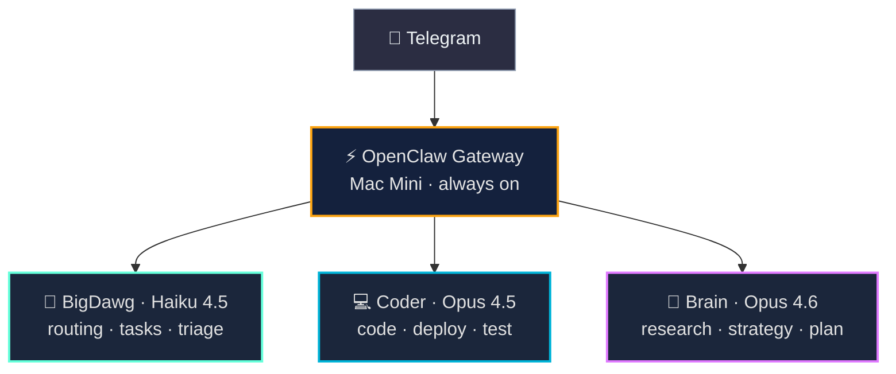
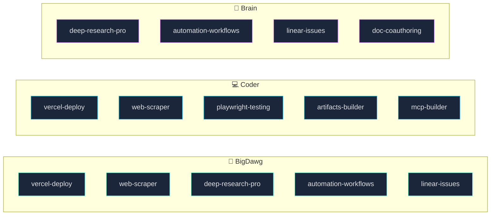
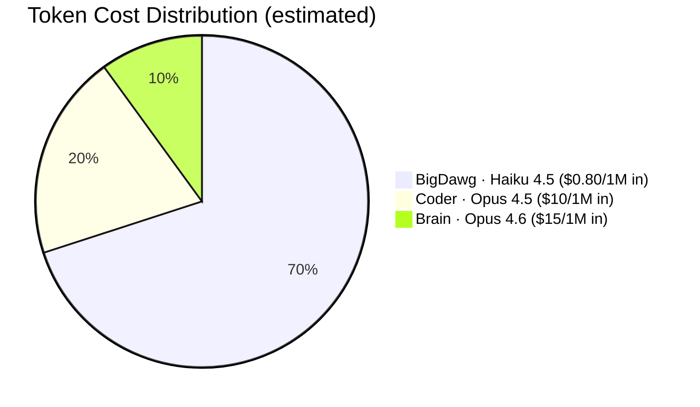
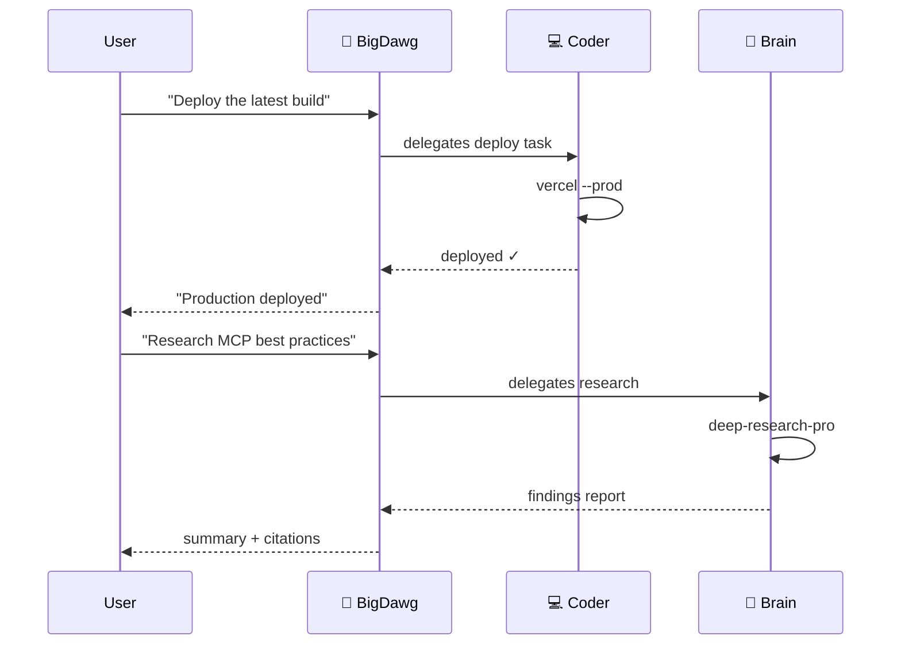

# openclaw-setup

Multi-agent AI system powered by [OpenClaw](https://openclaw.ai/) and Anthropic Claude. Three specialized agents running 24/7 on a dedicated Mac Mini.

## Architecture



## Skill Distribution



## Cost Model



Most messages hit BigDawg on Haiku — fast and cheap. Complex work routes to Opus only when needed. Prompt caching, context pruning, and low thinking defaults keep costs tight.

## Orchestration



## Structure

```
├── agents/                    # Agent identities and personas
│   ├── bigdawg/               # Main agent (Haiku 4.5)
│   ├── coder/                 # Code agent (Opus 4.5)
│   └── brain/                 # Strategy agent (Opus 4.6)
├── skills/                    # Custom skills (SKILL.md standard)
│   ├── linear/                # Linear issue tracking
│   ├── vercel-deploy/         # Vercel deployment
│   ├── deep-research/         # Multi-source research
│   └── playwright-testing/    # Browser testing
├── docs/
│   ├── ARCHITECTURE.md        # System design and data flow
│   ├── ORCHESTRATION.md       # Agent coordination patterns
│   └── SKILLS.md              # Skill creation standards
└── README.md
```

## Skills Standard

Skills follow the [SKILL.md universal standard](https://agentskills.io/specification) — the same format used by Claude, Cursor, GitHub Copilot, and Codex.

```yaml
---
name: skill-name
description: What it does and when to use it
metadata: {"openclaw": {"emoji": "🔧", "requires": {"env": ["API_KEY"]}}}
---
```

See [docs/SKILLS.md](docs/SKILLS.md) for the full creation guide.

## Docs

- [Architecture](docs/ARCHITECTURE.md) — System design, cost model, data flow
- [Orchestration](docs/ORCHESTRATION.md) — How agents coordinate and delegate
- [Skills](docs/SKILLS.md) — How to create and assign skills

## Stack

OpenClaw · Anthropic Claude · Telegram · Vercel · Linear · Playwright · GitHub
