# openclaw-setup

Multi-agent AI system powered by [OpenClaw](https://openclaw.ai/) and Anthropic Claude. Three specialized agents running 24/7 on a dedicated Mac Mini.

## Architecture

```mermaid
graph TD
    T["📨 Telegram"] --> GW
    GW["⚡ OpenClaw Gateway
    Mac Mini · always on"] --> A & B & C

    A["🦞 BigDawg · Haiku 4.5
    routing · tasks · triage"]
    B["💻 Coder · Opus 4.5
    code · deploy · test"]
    C["🧠 Brain · Opus 4.6
    research · strategy · plan"]

    style T fill:#2b2d42,stroke:#8d99ae,color:#edf2f4
    style GW fill:#14213d,stroke:#fca311,color:#e5e5e5,stroke-width:2px
    style A fill:#1b263b,stroke:#64ffda,color:#e0e0e0,stroke-width:2px
    style B fill:#1b263b,stroke:#00b4d8,color:#e0e0e0,stroke-width:2px
    style C fill:#1b263b,stroke:#e07aff,color:#e0e0e0,stroke-width:2px
```



## Skill Distribution


## Cost Model

```mermaid
pie title Token Cost Distribution (estimated)
    "BigDawg · Haiku 4.5 ($0.80/1M in)" : 70
    "Coder · Opus 4.5 ($10/1M in)" : 20
    "Brain · Opus 4.6 ($15/1M in)" : 10
```



Most messages hit BigDawg on Haiku — fast and cheap. Complex work routes to Opus only when needed. Prompt caching, context pruning, and low thinking defaults keep costs tight.

## Orchestration

```mermaid
sequenceDiagram
    participant U as User
    participant BD as 🦞 BigDawg
    participant CO as 💻 Coder
    participant BR as 🧠 Brain

    U->>BD: "Deploy the latest build"
    BD->>CO: delegates deploy task
    CO->>CO: vercel --prod
    CO-->>BD: deployed ✓
    BD-->>U: "Production deployed"

    U->>BD: "Research MCP best practices"
    BD->>BR: delegates research
    BR->>BR: deep-research-pro
    BR-->>BD: findings report
    BD-->>U: summary + citations
```



## Structure

```
├── agents/                    # Agent identities and personas
│   ├── bigdawg/               # Main agent (Haiku 4.5)
│   ├── coder/                 # Code agent (Opus 4.5)
│   └── brain/                 # Strategy agent (Opus 4.6)
├── skills/                    # Custom skills (SKILL.md standard)
│   ├── linear/                # Linear issue tracking
│   ├── vercel-deploy/         # Vercel deployment
│   ├── deep-research/         # Multi-source research
│   └── playwright-testing/    # Browser testing
├── docs/
│   ├── ARCHITECTURE.md        # System design and data flow
│   ├── ORCHESTRATION.md       # Agent coordination patterns
│   └── SKILLS.md              # Skill creation standards
└── README.md
```

## Skills Standard

Skills follow the [SKILL.md universal standard](https://agentskills.io/specification) — the same format used by Claude, Cursor, GitHub Copilot, and Codex.

```yaml
---
name: skill-name
description: What it does and when to use it
metadata: {"openclaw": {"emoji": "🔧", "requires": {"env": ["API_KEY"]}}}
---
```

See [docs/SKILLS.md](docs/SKILLS.md) for the full creation guide.

## Docs

- [Architecture](docs/ARCHITECTURE.md) — System design, cost model, data flow
- [Orchestration](docs/ORCHESTRATION.md) — How agents coordinate and delegate
- [Skills](docs/SKILLS.md) — How to create and assign skills

## Stack

OpenClaw · Anthropic Claude · Telegram · Vercel · Linear · Playwright · GitHub
