# Architecture

## Overview

Three specialized Claude agents running on a dedicated Mac Mini via OpenClaw, accessible through Telegram 24/7.

## Agent Hierarchy

```mermaid
graph TD
    T["📨 Telegram"] --> GW
    GW["⚡ OpenClaw Gateway
    ws://127.0.0.1:18789"] --> A & B & C

    A["🦞 BigDawg · Haiku 4.5
    default · cheapest · fastest"]
    B["💻 Coder · Opus 4.5
    code · deploy · test"]
    C["🧠 Brain · Opus 4.6
    research · strategy · plan"]

    style T fill:#2b2d42,stroke:#8d99ae,color:#edf2f4
    style GW fill:#14213d,stroke:#fca311,color:#e5e5e5,stroke-width:2px
    style A fill:#1b263b,stroke:#64ffda,color:#e0e0e0,stroke-width:2px
    style B fill:#1b263b,stroke:#00b4d8,color:#e0e0e0,stroke-width:2px
    style C fill:#1b263b,stroke:#e07aff,color:#e0e0e0,stroke-width:2px
```

## Routing

OpenClaw uses **binding-based routing** (channel + peer), not keyword-based. All Telegram DMs route to BigDawg by default. To reach other agents:

- **CLI**: `openclaw agent --agent coder --message "..."`
- **Bindings**: Configure per-peer routing in `openclaw.json`
- **Subagents**: Agents can delegate to each other via `sessions_send`

```mermaid
flowchart LR
    MSG["Inbound message"] --> R{Route resolver}
    R -->|peer match| AGENT1["Bound agent"]
    R -->|channel match| AGENT2["Channel agent"]
    R -->|no match| DEFAULT["🦞 BigDawg"]

    style MSG fill:#2b2d42,stroke:#8d99ae,color:#edf2f4
    style R fill:#14213d,stroke:#fca311,color:#e5e5e5
    style AGENT1 fill:#1b263b,stroke:#64ffda,color:#e0e0e0
    style AGENT2 fill:#1b263b,stroke:#00b4d8,color:#e0e0e0
    style DEFAULT fill:#1b263b,stroke:#64ffda,color:#e0e0e0,stroke-width:2px
```

## Cost Model

| Agent | Model | Input $/1M | Output $/1M | Use Case |
|-------|-------|-----------|------------|----------|
| BigDawg | Haiku 4.5 | $0.80 | $4.00 | ~80% of messages |
| Coder | Opus 4.5 | $10.00 | $50.00 | Complex coding |
| Brain | Opus 4.6 | $15.00 | $75.00 | Deep thinking |

Optimizations applied:
- **Prompt caching**: "long" retention on Opus models (up to 90% savings)
- **Context pruning**: Auto-clear old tool results after 5 minutes
- **Compaction**: Memory flush before context summarization
- **Thinking default**: "low" across all agents, dial up when needed

## Data Flow

## Skill Distribution

| Skill | BigDawg | Coder | Brain |
|-------|:-------:|:-----:|:-----:|
| vercel-deploy | x | x | |
| web-scraper | x | x | |
| deep-research-pro | x | | x |
| automation-workflows | x | | x |
| linear-issues | x | | x |
| playwright-testing | | x | |
| artifacts-builder | | x | |
| mcp-builder | | x | |
| doc-coauthoring | | | x |
